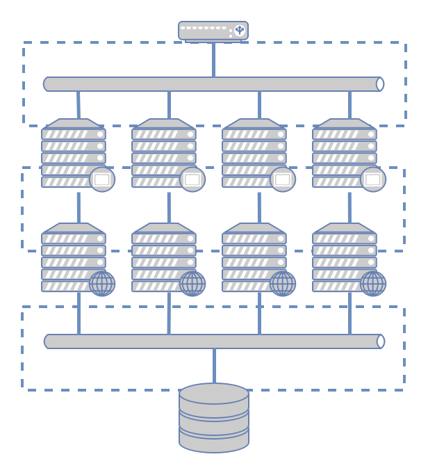

# Labo 3: Vagrant Extended
Voor volgende opdracht gaan we Vagrant gebruiken voor het opzetten van een
multimachine omgeving. Meeste webapplicaties draaien op meer dan een server.
Tijdens het volgende labo gaan we beginnen met het opzetten van een mulimachine
omgeving.  Deze zal dienen als de fundering voor de volgende labos. Het
resultaat van deze labo is een miniproject. Dit zal ook later herbruikt worden
voor een groter project. 

Onze multimachine omgeving zal er als volgt uitzien:



Vooraan onze opstelling staat een loadbalancer, deze taak word opgenomen door
een server waarop HAProxy draait. daarachter staan in parallell de caching
servers die content van de achterstaande applicatie servers ter beschikking
stellen. De applicatie servers halen hun dta vanuit een database.  Elke lijn
die je ziet op de tekening kan vergelijken met een netwerk interface.  Er is
ook een scheiding tussen verschillende netwerken. De caching gebeurt door
gebruik te maken van nginx. De applicatie server zal een Flask (Python)
applicatie zijn met een front end geschreven in ReactJS. De database is MySQL.


## Opdracht
Beschrijf deze omgeving door gebruik te maken van Vagrant. Leg vooral de focus
op het beschrijven van de machines en opzetten van de netwerken. Zorg er ook
voor de dat de basis applicaties er op staan.

## Projectstructuur 
Gebruik volgende map structuur als basis voor het opbouwen van het labo

```
dops_basic_infrastructure
├── backend_app
│   └── README.md
├── cfg
│   ├── backend_conf
│   ├── db_conf
│   ├── frontend_conf
│   └── lb_conf
├── frontend_app
│   └── README.md
├── playbooks
│   ├── backend.yml
│   ├── db.yml
│   ├── frontend.yml
│   └── lb.yml
└── Vagrantfile
```

### Requirements
* Toon aan dat alle servers worden opgestart 
* Installeer alle applicaties met behulp van Ansible
 * Schrijf een playbook voor elke file
 * Houd de config files bij en kopieer deze vanuit de shared folder
* Toon aan de servers niet van overal beschikbaar zijn.
* Limiteer de resources van de server (memory = 512MB, cpu =1)
* Zet het project onder versie controle
  * Ontwikkel dit labo onder de branch `infra/alpha`

### Extra Informatie
Zie ook deze video tutorial voor meer informatie
[Sysadmin Cast Ep. #43](https://sysadmincasts.com/episodes/43-19-minutes-with-ansible-part-1-4)
